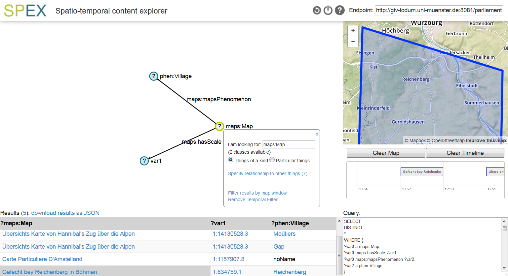

# SPEX

 

The Spatial-Temporal Content Explorer (SPEX) is a tool for exploring data stored according to the Resource Description Framework (RDF) specifications and published on a SPARQL endpoint.
The tool can be opened in the browser, and enables the user to explore contents, visually construct a query, add spatial and temporal constraints to the query, and retrieve the data returned by the search / query.
The idea of the tool is to enable any user to search for (spatio-temporal) data stored in the RDF format. This is usually only possible using the SPARQL Protocol and RDF Query Language (SPARQL), but by using SPEX, the work of formulating the search in the SPARQL syntax is simplified through visual feedback mechanisms. This way, the user doesn't require any prior knowledge of the SPARQL syntax for extracting data from the RDF-database or about available vocabularies.
The code of SPEX is based on HTML, CSS, Javascript, and uses the javascript and css-based libraries jQuery, d3, bootstrap, leaflet and timeline.

See also:
- <a href="http://www.semantic-web-journal.net/content/exploratory-querying-sparql-endpoints-space-and-time-1">Article that describes SPEX principles</a>
- <a href="http://giv-lodum.uni-muenster.de/spex/">Running version</a>
- <a href="http://giv-lodum.uni-muenster.de/spex/help.html">Tutorial</a>

<b> Basic functionality </b>

SPEX enables the user to visually construct the query in the query pane (Top left, main part of the screen). In the background, the data entered by the user is stored and translated into the syntax of SPARQL, the language in which RDF databases are queried.

<b> Adding constraints </b>

The user can additionally add constraints to certain elements of the visually constructed query: In case any element of the query can be related to space or time (for example countries or wars), it is highlighted, and spatial constraints can be added using the map window (top right of the screen). Temporal constraints are added using the timeline (right side, under the map window). These constraints are also translated into the sparql syntax, and added to the existing query.

Linked data Vocabularies used for space and time representation (compare class FilterExpander.js):
- XSD Date and Time Data Types (xsd:gYear)
- <a href="http://www.w3.org/2006/time"> OWL-Time</a>
- <a href="http://www.w3.org/2003/01/geo/wgs84_pos"> W3C Geo (WGS84 based)</a>
- <a href="http://www.opengis.net/ont/geosparql"> GeoSPARQL Ontology (OGC compatible)</a>

<b> Execution of the query and displaying the results </b>

The resulting SPARQL query is sent (as a string, as a HTTP request) to the SPARQL endpoint specified in the tool (textfield at the top right). The response of this HTTP request contains the result of the query, which is extracted and displayed as a table in the results pane (bottom left, under the query pane). In addition, if the results have any spatial data (points, geometries), these are displayed in the map window. Any temporal information (points of time, time intervals) is displayed in the timeline.
The queries are fired in real-time: Every time the user modifies the visual query, a new query is sent to the endpoint and the results are loaded into the results pane.

To aid the user while constructing the visual query, the tool makes suggestions: Whenever the user starts making a change to the existing visual query at a particular point, another query is fired in the background, which retrieves information about what additions to the query at this point have any results at all. These possibilities are the displayed to the user as suggestions, from which he/she can choose.

 
 
 
